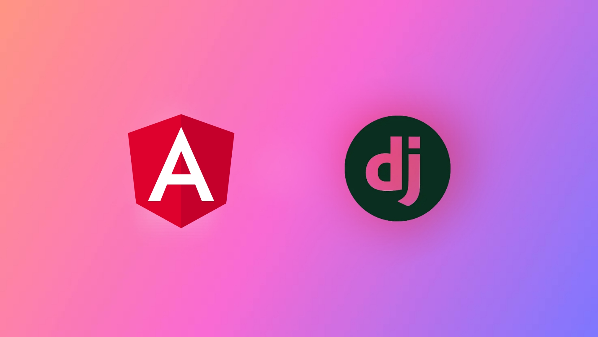

## Set Up

[Frontend Set Up](https://github.com/PriDebnath/posts-v2/tree/main/frontend)

[Backend Set Up](https://github.com/PriDebnath/posts-v2/tree/main/backend)

## Blogs

[Angular and Ant setup](https://medium.com/@pritam-debnath/how-to-set-up-ant-design-in-your-angular-application-a-step-by-step-guide-b1058f3b8714)

[Django and DRF setup](https://medium.com/@pritam-debnath/how-to-set-up-django-and-create-restful-apis-a-conversational-guide-with-a-live-project-ce55992aa0b9​)

## Tutorials

#### Playlist

#### Angular tutorial

#### Django tutorial

.
